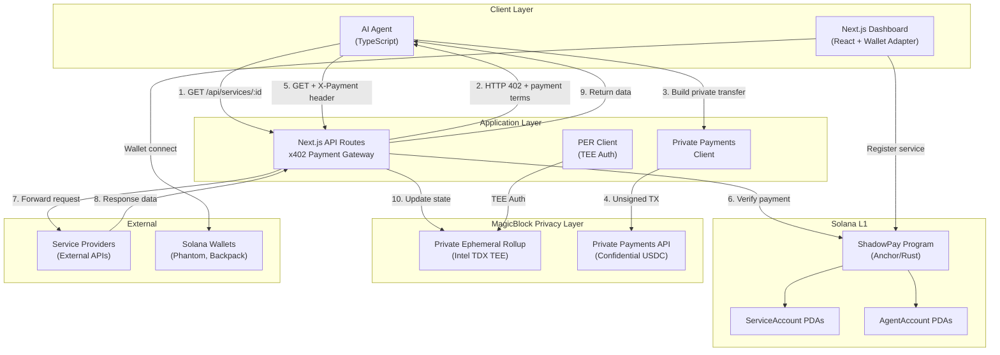
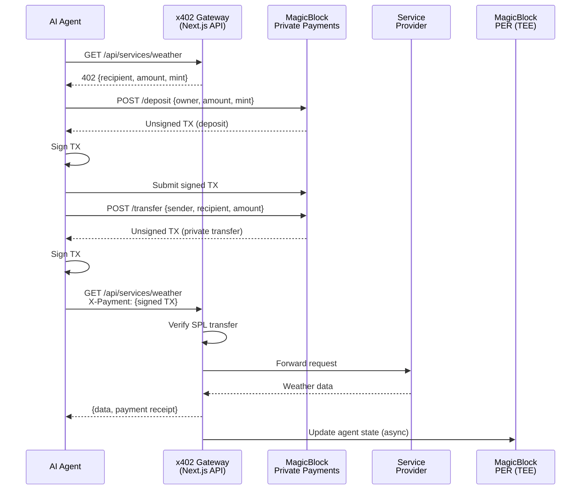

# Architecture — ShadowPay

## System Overview

ShadowPay is a private payment gateway for AI agent commerce on Solana. It combines three MagicBlock primitives (Ephemeral Rollups, Private Ephemeral Rollups, and the Private Payments API) with the x402 HTTP payment protocol to enable agents to transact without exposing balances or transaction history.

## Architecture Diagram

## Component Details

### 1. ShadowPay Anchor Program

**Location:** `programs/shadowpay/src/`

On-chain service and agent registry. Stores metadata about available API services and registered agents using PDAs.

**Accounts:**
- `ServiceAccount` — PDA seeds: `["service", owner, service_id]`
  - Fields: owner, service_id, endpoint, price_lamports, token_mint, description, active, created_at, bump
- `AgentAccount` — PDA seeds: `["agent", owner]`
  - Fields: owner, name, active, total_payments, created_at, bump

**Instructions:**
- `register_service` — Create a new service listing
- `register_agent` — Register an AI agent
- `update_service` — Modify service details (owner only)
- `deregister_service` — Mark service inactive (owner only)

### 2. x402 Payment Gateway

**Location:** `app/api/services/[id]/route.ts`

Next.js API route that implements the x402 payment protocol:
1. Receives request without payment -> returns HTTP 402 with payment requirements
2. Receives request with `X-Payment` header -> verifies SPL token transfer, submits TX, returns service data

Uses standard x402 flow compatible with any x402 client.

### 3. Private Payments Client

**Location:** `src/payments/`

Wrapper around MagicBlock's Private Payments API. Handles:
- `deposit()` — Move USDC into the private pool
- `transfer()` — Confidential USDC transfer between agents
- `withdraw()` — Move USDC back to Solana L1
- `getBalance()` — Query encrypted balance
- `signAndSend()` — Sign unsigned TX from API and submit

### 4. PER Client

**Location:** `src/per/`

Client for MagicBlock's Private Ephemeral Rollup:
- TEE integrity verification via remote attestation
- Auth token acquisition with wallet signature
- Private state queries for agent balances and transaction history
- Account delegation to PER

### 5. Next.js Dashboard

**Location:** `app/`

Web interface for managing services and agents:
- **Landing** (`/`) — Project overview and how-it-works
- **Services** (`/services`) — Browse and register API services
- **Agents** (`/agents`) — Deploy and monitor AI agents
- **Dashboard** (`/dashboard`) — Wallet info, balances, activity

### 6. Demo Agent

**Location:** `src/agent/`

Autonomous TypeScript agent that:
1. Discovers available services from the registry
2. Selects the cheapest service
3. Executes the full x402 payment flow
4. Logs results

## Data Flow: Private Agent Payment

## Security Model

1. **Payment Privacy:** MagicBlock Private Payments API routes USDC through a TEE-backed pool. The final settlement produces a standard SPL transfer, but the routing hides the sender-receiver link.

2. **State Privacy:** Agent balances and transaction history stored in PER are only accessible via TEE-authenticated queries. On-chain observers see delegation but not the private state.

3. **On-chain Integrity:** Service registry lives on Solana L1 for transparency. Only owners can modify their services (enforced by Anchor constraints).

4. **x402 Verification:** The gateway verifies payment by parsing the SPL token transfer instruction in the signed transaction, simulating it, and confirming on-chain settlement before serving content.
